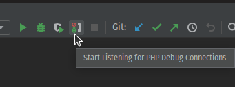
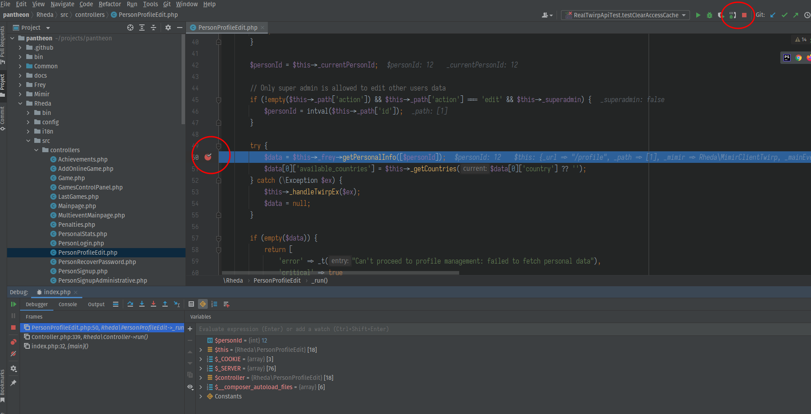

## Pantheon debugging with PhpStorm

Pantheon service uses XDebug module for backend debugging. The module is already included
into the container, though the IDE needs some setup before you start.

### Step 1: configure debugger

Port 9001 is used to reach external debug tool. Make sure you set it to proper value on 
Debug page. Check all the checkboxes here.

### Step 2: configure path mappings

Add new server on the Servers page, point its host to `localhost`. Port field can have 
any value. Make sure you check "Use path mappings" checkbox and fill the paths exactly as
shown on the screenshot. Note that inside container all services are located inside
`/var/www/html` folder. The folder itself should be pointed to the project root.

### Step 3: press the "Listen" button

Right here!

### Step 4: set some breakpoints and try to reload the page!

There you go. Now your breakpoints should be working. Note that Frey and Mimir are separate 
services with their own entry points, so you should always check if the request is really being
sent before adding breakpoints to Mimir or Frey code.
