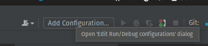
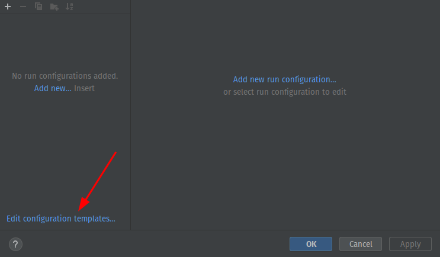
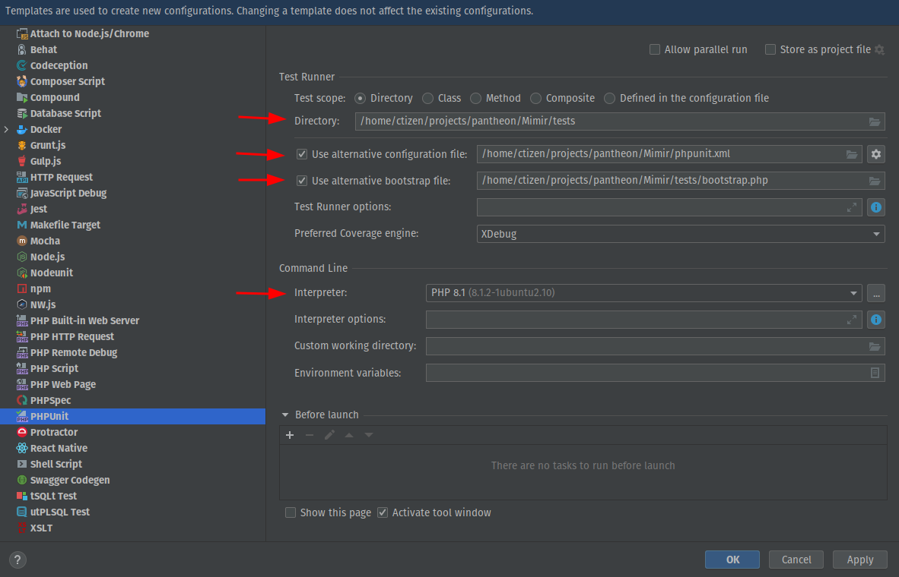
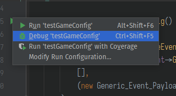

## Pantheon debugging with PhpStorm

Pantheon service uses XDebug module for backend debugging. The module is already included
into the container, though the IDE needs some setup before you start.

### Step 0: enable debug in containers

Run `make enable_debug` in the root folder.

Please note: this enables debugging extension for PHP in all related containers and after this the containers
will try to reach debugging client (like phpstorm) for every request. If the debug client is not running,
it will retry for 5 times, adding ~200ms of delay for each retry.

If you experience huge (~1.2s) delays on backend handles, that means the debugging client is not running. If you don't
want to use debugger for a while and want to get rid of the delays, use `make disable_debug`.

### Step 1: configure debugger

Port 9001 is used to reach external debug tool. Make sure you set it to proper value on 
Debug page. Check all the checkboxes here.

### Step 2: configure path mappings

For each php service, add new server on the Servers page, point its host to `localhost`. Port field can have 
any value. Make sure you check "Use path mappings" checkbox and fill the paths exactly as
shown on the screenshot. Note that inside container all services are located inside
`/var/www/html` folder. The folder itself should be pointed to the project root. Server names should be following:
- mimir.pantheon.internal
- frey.pantheon.internal
- hugin.pantheon.internal
- gullveig.pantheon.internal

These server names are used by phpstorm to determine what server you're using.

### Step 3: press the "Listen" button

Right here!

### Step 4: add an explicit breakpoint in code

Use `xdebug_break();` instruction in the php code to trigger debugger session. This method
can be used in every case the previous one didn't work, as it doesn't require any external 
trigger.

Also you can try to use phpstorm breakpoints, though, sometimes explicit `xdebug_break()` is required.

## Debugging unit tests

As your IDE runs on your host machine and not inside any container, you will need some additional
setup to make unit tests debugging possible. Unfortunately, the setup process can't be automated,
so get ready for some adventures. 

**Note**: all of the instructions below are expected to work fine on *nix (Mac, Linux, *BSD) machines,
if you're using Windows, you better stick to WSL.

- First of all, you will need to install php-cli on your host machine. PHP should have version 8.0 or more.
- Next, you should ensure that all required PHP extensions are installed as well. Please refer to Dockerfile
  in the root of the repository for full list of php-related packages. Note that on some systems you
  might need to install the extensions using PEAR.
- You will also need PostgreSQL client tools to use `psql` command (usually, `postgresql-client` package
  or similar name).
- Finally, you should setup your IDE debug configuration templates as shown below:

Click "Add configuration" in toolbar

In opened window, choose "Edit configuration templates..."

Finally, in opened window select "PHPUnit" and set four parameters as shown on the screenshot.
**Note**: we use Mimir folder, configuration and bootstrap for this example. If you need to
debug Frey unit tests, these values should be changed accordingly.

**Why edit the template?**

PHPStorm offers nice integration with phpunit testing framework, but in order to use the
"Run selected test" functionality, it needs to create separate configuration for each 
test run:

By default, the settings of the configuration do not allow proper run of Mimir/Frey
tests (or at least not all of them would be run properly), thus we need to alter the template.

One notable thing that's happening inside the custom testing bootstrap is running separate
server to test real API calls. Take a look into tests/RealApiTest*.php files for further info.
