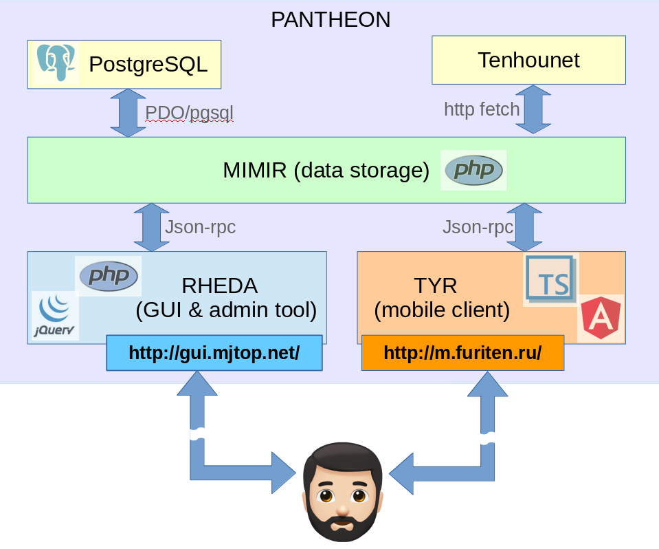

## Общая схема системы

Система pantheon состоит (на момент написания этих строк) из трех основных подсистем,
имеющих кодовые имена Mimir, Tyr и Rheda.

### Mimir - хранилище данных

Подсистема Mimir отвечает за хранение данных об играх, игроках, клубах, турнирах
и прочих дополнительных сущностях, позволяя получать и дополнять данные через
JSON-RPC API. Описание методов RPC можно найти в [документации по методам](../../Mimir/APIDOC.md).

Mimir не имеет собственного графического интерфейса, но при этом кроме него никто
другой не общается с базой данных (в качестве которой выступает PostgreSQL).

Помимо основной функции хранения данных, Mimir также обладает рядом дополнительных
функций, в частности:
- Умеет генерировать рассадку игроков для турнира, а также автоматически стартовать
игровую сессию с только что сгенерированной рассадкой.
- Умеет скачивать и вносить в базу данных онлайн-игры с тенхонета, для этого ему
достаточно только ссылки на реплей игры.

В целях безопасности, некоторые методы JSON RPC API прикрыты секретным токеном,
который должен передаваться в хедере http-запроса. К таким методам относятся, 
в частности, методы добавления произвольного игрока в турнир, старта произвольной игры.

Конфигурация Mimir происходит через набор конфигурационных файлов в папке config,
где задаются данные для доступа к базе данных, а также секретные токены.

### Rheda - интерфейс администратора и не только

Подсистема Rheda на данный момент выполняет как чисто отображающие функции
(показ рейтинговой таблицы, списка прошедших игр, страниц персональных статистик),
так и администраторские, при условии входа по паролю.

Rheda по сути представляет собой графический интерфейс к Mimir-у, внося некоторые
дополнительные возможности, вроде построения красивых графиков и статистик. Кроме
того, именно Rheda отвечает за разные интерфейсные представления списка игр и 
рейтинговой таблицы для мобильных устройств и для десктопа. Следует отметить, 
что на текущий момент в мобильном представлении отсутствуют администраторские
функции, хотя технически это и не является сложной задачей.

Конфигурация Rheda по большей части сводится к указанию в конфигурационных файлах
URLа, по которому доступен Mimir, а также заданию администраторских паролей для
конкретных турниров и рейтингов. Последнее следует рассматривать как временный 
костыль, который должен быть устранен при появлении системы единой авторизации и ACL.

### Tyr - мобильный интерфейс

Подсистема Tyr - это то, чем большую часть времени пользуются игроки в процессе
игры. Tyr является SPA-приложением, ориентированным на мобильные устройства,
целью которого является предоставление удобного способа ввода данных игры прямо
в процессе. 

Tyr общается с Mimir-ом, заходя на URL, который задается при сборке приложения.
Следует отметить, что у Tyr нет бэкендовой части (как у Rheda, в которой 
страницы рендерятся на сервере), и от сервера требуется только отдать уже
собранные js-скрипты и стили клиенту. 

Конфигурация Tyr состоит только в задании URL Mimir-а (см. README в папке подсистемы),
все остальные конфигурационные параметры прилетают из Mimir-а при первом вызове
метода getGameConfig для заданного события.