## Описание экранов и их функциональности

Каждый экран разделен условно на верхнюю область с кнопками навигации (назад-вперед) и на основную область. Содержимое и кнопки панели навигации зависят от текущей страницы, но кнопка "Назад" как правило существует всегда (впрочем, в отдельных случаях она может быть неактивна).

У всех экранов есть общие цели:

- Сокращение количества ошибок при вводе данных
- Помощь игроку в процессе ввода данных, например подсчет количества хан, индикация несовместимых яку, автоматический учет числа хонбы и т.д.

### 0. Экран ожидания (прелоадер)
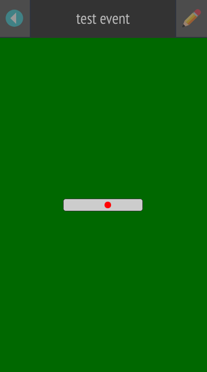

Этот экран отображается, когда еще не все данные получены с сервера.

В панели навигации отображается название события, если оно уже получено, либо ничего не отображается.

В основной области - условная "риичи-палочка" с бегающей влево-вправо красной точкой.

##### Основные требования к оформлению

- На экране должен быть некий неинтерактивный элемент, ясно показывающий, что в данный момент идет обработка данных и требуется подождать.

### 1. Экран ввода пин-кода
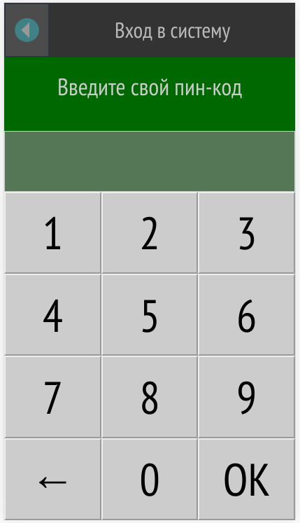

Этот экран отображается, если пользователь не вошел в систему.

Введенный пин-код однозначно идентифицирует пару "игрок + турнир/рейтинг". После ввода пин-кода и успешной авторизации на сервере этот экран не будет отображаться.

Вводимые цифры отображаются в области над клавиатурой и заменяются на звездочки в течение двух секунд. Можно откорректировать ввод кнопкой со стрелкой.

В панели навигации - статический текст "Вход в систему", кнопка "Назад" неактивна.

##### Основные требования к оформлению

- Экран должен предоставлять простой и понятный метод ввода пин-кода. 
- Управляющие кнопки должны быть достаточно большими для того, чтобы их было удобно использовать на touch-устройствах.

### 2. Стартовый экран
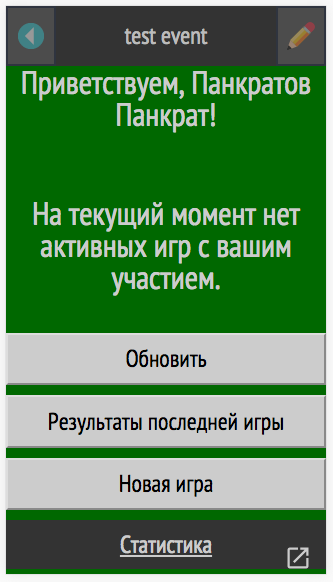

Игрок попадает на этот экран в случае, если на текущий момент нет игр, в которых он участвует, в ином случае он попадает сразу на экран обзора текущей игры (4).

- В панели навигации отображается название текущего турнира или рейтинга. Кнопка "Назад" неактивна.
- В основной области отображается имя игрока, чтобы игрок понимал, что он зашел именно под собой.
- В нижней половине экрана отображающтся кнопки действий:
  - Обновить: обновляет данные в приложении принудительно, если с момента последнего обновления началась игра, отправляет игрока на страницу обзора текущей игры (4).
  - Результаты последней игры: отображает результаты предыдущей завершенной игры (10) текущего игрока в текущем турнире/рейтинге.
  - Новая игра: переход на экран выбора участников игры (3). Для турниров кнопка не отображается, поскольку в турнирах игры начинаются автоматически без участия игроков.
  - Статистика: представляет собой гиперссылку для перехода на сайт статистики по текущему турниру/рейтингу. Открывает в новой вкладке.

##### Основные требования к оформлению

- Экран должен давать информацию о том, в какой турнир и какой игрок залогинен в данный момент.
- Назначение управляющих кнопок и ссылок должно быть однозначно понятно из надписей или оформления.

### 3. Выбор участников игры
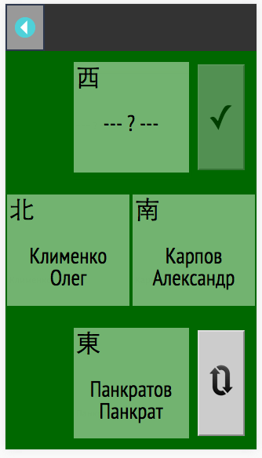

Экран нужен для организации произвольной игры в рамках клубных рейтингов или свободных игр по инициативе игроков. В турнирах этот экран недоступен.

- В панели навигации нет ничего, кроме кнопки "Назад".
- В основной области - четыре блока с ветрами и именами игроков. При клике в каждый из них открывается список игроков, из которого можно выбрать нужного.
- В правом нижнем углу располагается кнопка перемешивания игроков за столом
- В правом верхнем углу - кнопка старта игры с текущим составом и рассадкой. Кнопка может быть неактивна в случаях, когда выбраны не все игроки, либо когда один и тот же игрок выбран на несколько мест за столом.

##### Основные требования к оформлению

- Экран должен давать понятный способ выбора игроков для новой игры.
- Нужно уметь рассаживать игроков и случайным образом, и заранее определенным.

### 4. Обзор текущей игры
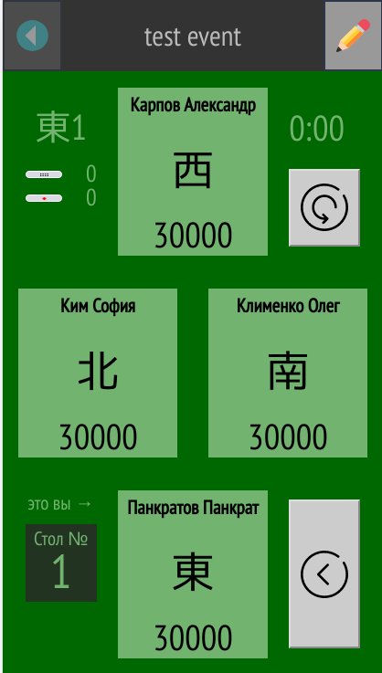

Экран нужен для отображения текущей ситуации за столом.

- В панели навигации - название текущего турнира/рейтинга.
  - Кнопка "Назад" неактивна
  - Кнопка "Вперед" имеет иконку с карандашом и открывает экран выбора исхода раздачи (6) для записи новой сыгранной раздачи.
- В основной области видны четыре блока с именами игроков:
  - В блоке всегда есть имя игрока, его текущий ветер (меняется в ходе игры) и количество очков
  - Справа от ветра может быть красный индикатор с цифрой, показывающий, сколько штрафов чомбо получил игрок за текущую игру.
  - В нижний блок всегда попадает текущий игрок.
  - При нажатии в любой из блоков очки пересчитываются таким образом, чтобы видеть насколько каждый из игроков впереди или позади выбранного. Выбранный блок подсвечивается другим цветом.
- В левом верхнем углу указывается текущий раунд, количество хонбы/ренчанов, количество риичи-ставок на кону (перешедших из предыдущей раздачи).
- В левом нижнем углу указывается номер стола, за который должен пройти игрок. Если игра не турнирная, номер стола не отображается.
- В правом верхнем углу отображается таймер и кнопка "Обновить".
  - Обновление может быть полезно в случаях, если ввод раздач осуществляет другой игрок. Результаты на экране не обновляются автоматически.
  - Таймер "тикает" в реальном времени, при этом он синхронизирован с общим игровым таймером. 
  - Если таймер входит в красную зону (обычно 5 минут до конца игры), он подсвечивается красным.
  - Таймер отсутствует для рейтинговых клубных игр и свободных игр.
- В правом нижнем углу отображается кнопка, ведущая на экран последней внесенной раздачи (5).

##### Основные требования к оформлению

- Экран должен давать максимум информации о состоянии игры за столом.
- Позиции игроков на экране должны соответствовать их позициям в реальной игре.
- Интерактивность должна быть сведена к минимуму.
- Назначение управляющих кнопок должно быть предельно ясно из надписей или оформления.

### 5. Просмотр последней внесенной раздачи
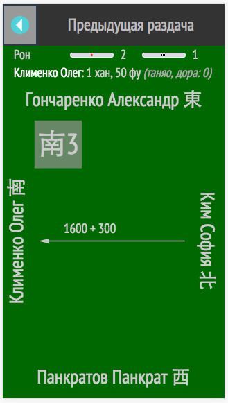

Экран нужен для того, чтобы при необходимости убедиться постфактум в том, что предыдущая раздача внесена корректно. При помощи администраторов или судей последнюю раздачу можно отменить и ввести заново (отмена раздачи не входит в задачи мобильного приложения).

- В панели навигации - статический заголовок "Предыдущая раздача", кнопки "Вперед" нет.
- В первой строке главного экрана - исход (Рон, Цумо, итд) и состояние стола на момент внесения раздачи - количество риичи и хонбы на кону.
- Во второй строке (а также третьей и четвертой, если был дабл или трипл рон) указывается имя выигравшего, количество хан и фу, а также яку, которые он собрал.
- Последним элементом является схема выплат (11), описанная отдельно.

##### Основные требования к оформлению

- Экран должен давать полную информацию о последней внесенной раздаче при любом исходе.
- Интерактивность отсутствует.

### 6. Выбор исхода раздачи
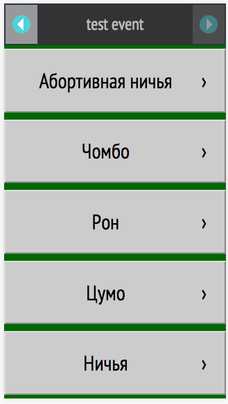

Экран нужен для выбора конкретного исхода при вносе новой раздачи.

- В панели навигации - название текущего турнира/рейтинга, кнопка "Вперед" неактивна, т.к. ее функции выполняют кнопки в основной области
- В основной области - ряд кнопок с названиями исходов. В зависимости от правил стола, могут присутствовать или отсутствовать кнопки "Абортивная ничья" и "Дабл/трипл рон".

##### Основные требования к оформлению

- Экран нужен для того, чтобы четко разделить разные исходы раздачи. От выбора исхода на этом экране зависит множество параметров на следующих экранах, именно поэтому этот выбор вынесен на отдельный экран.
- Должно быть видно, что выбор конкретного исхода определяет дальнейшие действия по вводу данных. 

### 7. Выбор игроков
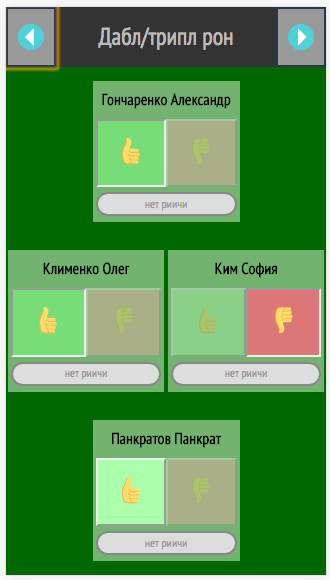
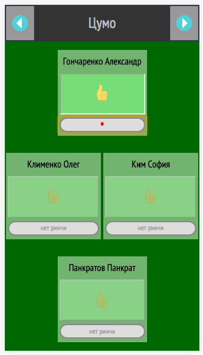
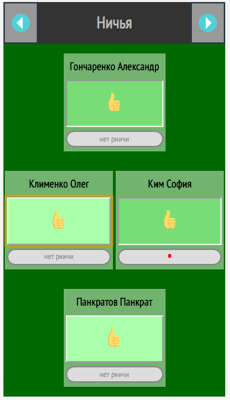
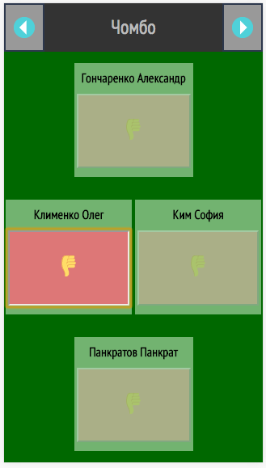
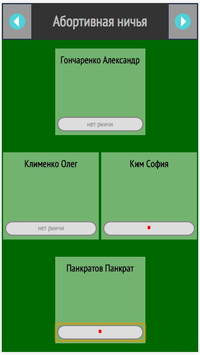

Экран нужен для выбора победителя, проигравшего и ставок риичи на столе. В зависимости от выбранного исхода в блоках может не быть практически всех элементов. Обязательно в блоке будет только имя игрока.

Кнопки выбора победителя и проигравшего вызывают деактивацию других кнопок в зависимости от логики конкретного исхода. Кроме того, в ряде случаев нажатие на кнопку риичи может автоматически "нажать" кнопку победителя (например, при ничьей).

##### Основные требования к оформлению

- Экран должен давать понятный способ выбора победителей и проигравших.
- Для разных исходов состав блоков экрана может быть разным и это должно выглядеть понятно.

### 8. Выбор яку
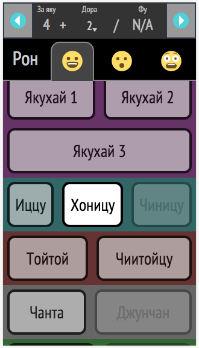
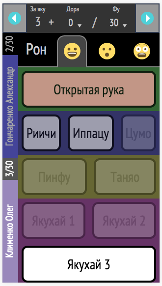

Экран нужен для выбора яку, которые собрал игрок. 

- В панели навигации - активные элементы, позволяющие выбрать количество дор и фу. Кроме того, там же отображается количество хан, полагающееся игроку за яку, выбранные в основной области.
- Первая строка основной области отображает название исхода (рон или цумо), а также вкладки со смайликами. Смайлики означают три группы яку: 1) обычные, 2) достаточно редкие, 3) якуманы. При проскролле основного списка вкладки переключаются автоматически; при нажатии на вкладку - скроллится основной список.
- Остальную часть пространства занимает список кнопок с названиями яку.
  - Яку отсортированы по степени популярности (условно).
  - Кнопка "Открытая рука" вынесена на самый верх, поскольку она определяет стоимость некоторых яку и поэтому должна быть нажата в первую очередь
  - Выбранные яку подсвечиваются цветом. Яку, которые несовместимы с выбранными, отображаются полупрозрачными.
  - Яку "риичи" и "дабл-риичи" не могут быть выбраны из списка, при попытке это сделать выдается предупреждение. Яку риичи проставляется автоматически, если у победителя указана ставка риичи на предыдущем экране.
- В случае, если выбран дабл или трипл рон, с левой стороны списка отображается список победителей, для каждого из которых требуется выбрать список яку.

##### Основные требования к оформлению

- Экран должен давать понятный способ выбора конкретных яку.
- Чем быстрее получится выбрать самые популярные яку, тем лучше.
- Нужно уметь быстро и понятно выбирать количество дор в руке и подсчитанное количество фу.
- Минимизировать количество возможных ошибок при вводе.

### 9. Предпросмотр вводимых данных
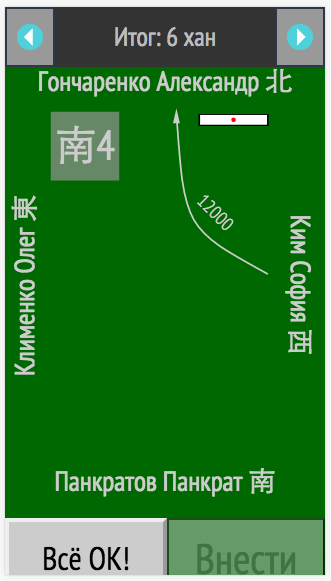
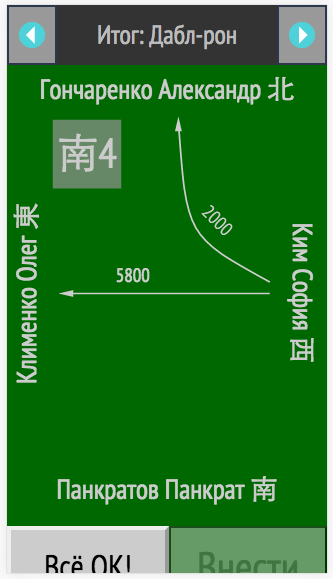

Экран предпросмотра состоит из схемы выплат (11) и двух кнопок - "Все ОК" и "Внести". 

- В панели навигации отображается название исхода
- Кнопка "Вперед" скроллит текущую страницу до самого конца, открывая кнопки "Все ок" и "Внести".
- Кнопки "Все ок" и "Внести" расположены по умолчанию за пределами экрана, чтобы затруднить рефлекторное нажатие на них без проверки результата визуально.

##### Основные требования к оформлению

- Экран должен ясно давать представление о том, какие выплаты производятся
- Экран должен удерживать игрока от механического нажатия на кнопку окончательного согласия, провоцировать дополнительно проверить данные.

### 10. Просмотр результатов игры
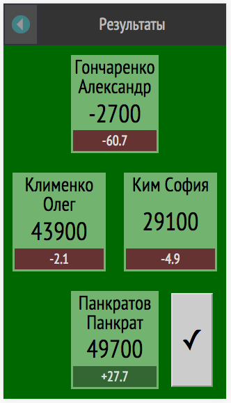

Экран результатов состоит из привычных четырех блоков с именами игроков. Помимо имен в блоках отображаются их очки на момент окончания игры, а также итоговые рейтинговые очки (после нормализации и прибавления умы/оки).

В правом нижнем углу располагается кнопка перехода на стартовый экран (2).

##### Основные требования к оформлению

- Экран должен выводить в простой форме результаты игры.
- Интерактивность отсутствует.

### 11. Компонент: схема выплат
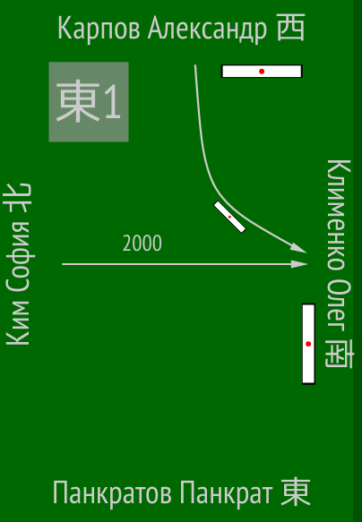

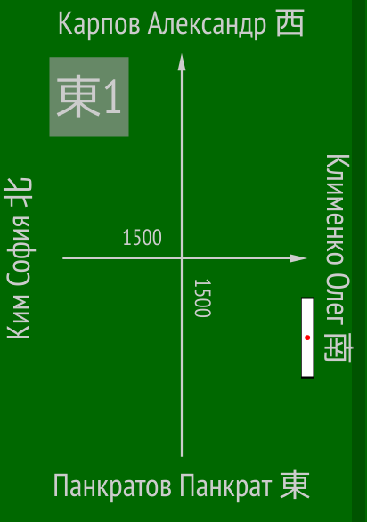
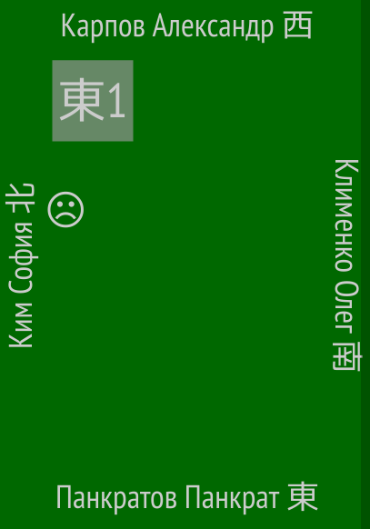

Схема выплат - компонент, используемый на экранах просмотра последней раздачи (5) и предпросмотра вводимых данных (9).

- Включает имена игроков по сторонам прямоугольника
- Под каждым именем может отображаться риичи-палочка, если игрок сделал ставку во вносимом раунде
- Между игроками отображаются стрелки, отображающие направления выплат.
- Возле каждой стрелки отображается размер выплаты.
- Кроме того, если стрелка отвечает за передачу риичи-ставки, около стрелки отображается схематичная риичи-палочка.
- В левом верхнем углу обозначается номер текущего раунда.
- В случае чомбо рядом со штрафумым игроком отображается индикатор-смайлик.

##### Основные требования к оформлению

- Компонент должен максимально понятным образом отображать схему и размеры выплат одних игроков другим для любого возможного исхода.
- Также понятным образом должны отображаться ставки риичи и то, как они переходят между игроками.
